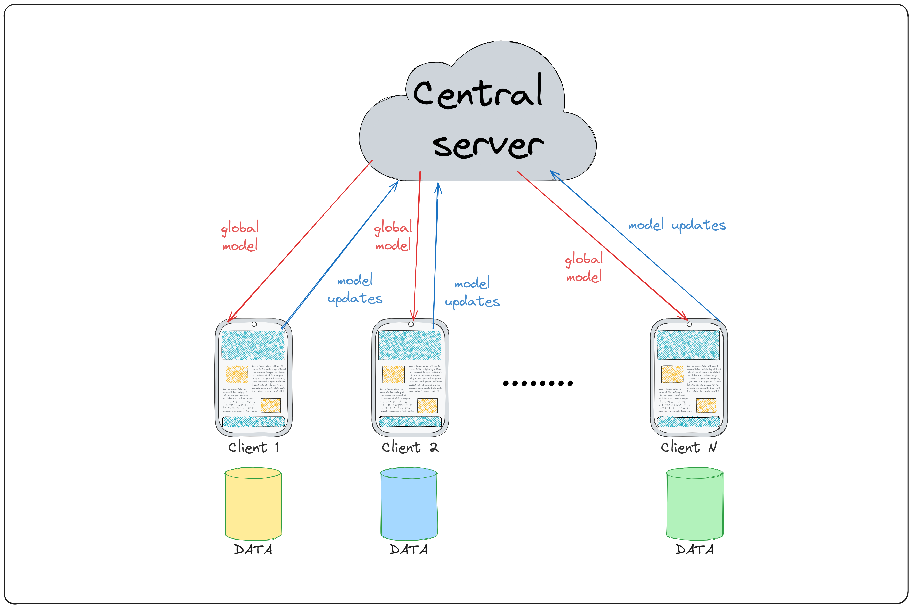

# Privacy-Preserving Face Recognition with Federated Learning

An experimental face-recognition training system that uses federated learning to keep raw biometric images on each participant's device. Clients train locally with PyTorch and Flower, then send model updates to a coordinating server for aggregation.

> This is a research prototype, not a production authentication system. Federated learning reduces raw-data centralization but does not by itself guarantee privacy against model-update leakage, membership inference, or model inversion.

## Features

- FaceNet (`InceptionResnetV1`) feature extractor initialized from VGGFace2 weights.
- Positive-only local loss: each client trains only on its own face images.
- Mean-feature initialization for each client's class embedding in the first round.
- Flower server and client entry points for networked federated training.
- Offline simulator for experimenting with multiple local client partitions.
- Weighted FedAvg aggregation with optional server-side spreadout regularization for class embeddings.

## How it works

1. The server initializes a shared feature extractor and a class-embedding matrix.
2. Each client receives the shared model, initializes its own embedding from local features, and trains on its local images.
3. Clients return updated backbone parameters and their own embedding row; raw images are not part of the application protocol.
4. The server computes a weighted average of backbone updates, restores client embedding rows, and can apply spreadout regularization.



## Repository layout

```text
assets/                         Project diagrams used by documentation
scripts/                        Command-line entry points and data downloader
src/federated_project/          Application package
  client.py                     Flower client implementation
  server.py                     Flower server strategy
  simulation.py                 Offline federated-learning simulator
  dataset.py                    Dataset loading and client partitioning
  federation.py                 Parameter exchange and aggregation helpers
  model.py                      FaceNet-based model
  train.py                      Local training and loss functions
data/                           Local data location (dataset contents are ignored)
```

## Requirements

- Python 3.10 or newer
- pip
- A CUDA-enabled PyTorch installation is optional; the project falls back to CPU when CUDA is unavailable.

## Installation

Create and activate a virtual environment, then install the project:

```bash
python -m venv .venv
# Windows PowerShell
.venv\Scripts\Activate.ps1

pip install --upgrade pip
pip install -r requirements.txt
```

PyTorch installation varies by operating system and CUDA version. If you need GPU support, install the matching PyTorch build from the [official PyTorch installation guide](https://pytorch.org/get-started/locally/) before installing this project.

## Data layout

The dataset is deliberately excluded from version control. Do not commit face images or other biometric data.

For the offline simulator, use one directory per person:

```text
data/celebs/
  person_01/
    image_001.jpg
    image_002.jpg
  person_02/
    image_001.jpg
```

To download the example Celebrity Face Image Dataset to the ignored `data/celebs/` directory, run:

```bash
python scripts/download_data.py
```

Review the dataset's licence, terms, and consent requirements before downloading or using it. You are responsible for ensuring that your use of biometric data complies with applicable law and institutional policy.

## Usage

Run an offline simulation against a multi-person dataset:

```bash
python scripts/run_simulation.py --data-dir data/celebs --num-rounds 3
```

To run networked training, start the server first. `--num-clients` must match the number of participating clients:

```bash
python scripts/run_server.py --num-clients 2 --num-rounds 3
```

Then, on each client machine, point `--data-dir` to a folder containing only that participant's images:

```bash
python scripts/run_client.py --client-id 0 --num-clients 2 --data-dir path/to/client_0_images
python scripts/run_client.py --client-id 1 --num-clients 2 --data-dir path/to/client_1_images
```

Use `--help` with any script to view available training, networking, and regularization options.

## Privacy and security notes

- Raw image files are intended to remain local and are excluded by `.gitignore`.
- The current protocol transmits model parameters and a client embedding row. These values can still expose information; do not treat the implementation as a secure-aggregation or differential-privacy solution.
- Never add credentials, tokens, private keys, or `.env` files to the repository. Local environment files and common model artifacts are ignored by default.
- Use authenticated transport, access control, update validation, and a threat-model review before deploying this design beyond controlled research.

## Development status

The project is an early research prototype. Secure aggregation, formal privacy defenses, attack evaluation, comprehensive tests, and production deployment safeguards are not included.

## License

This project is licensed under the [MIT License](LICENSE).

